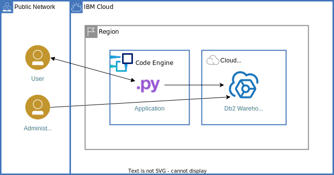

**Note**: A former version of the tutorial deployed the app to Cloud Foundry Public on IBM Cloud. You can find the material in the [branch **cloudfoundry**](https://github.com/IBM-Cloud/cloud-sql-database/tree/cloudfoundry).

# IBM Cloud SQL Database
This tutorial shows how to provision a SQL (relational) database service, create a table and load a larger data set, city information into the database. Thereafter, we deploy a web app "worldcities" to make use of that data and show how to access the cloud database. The app is written in Python using the Flask framework.

This tutorial is part of [IBM Cloud tutorials](https://cloud.ibm.com/docs/tutorials?topic=solution-tutorials-tutorials) and discussed as [SQL Database for Cloud Data](https://cloud.ibm.com/docs/solution-tutorials?topic=solution-tutorials-sql-database).

# Up and running in few steps
To get this SQL database-backed app up and running only few steps and about 10 minutes are needed. Please follow the steps outlined in the IBM Cloud tutorial.

To build your own container image and use it for the app, there different options available.
- Use `docker build` locally, then push the image to a [container registry and deploy it from there](https://cloud.ibm.com/docs/codeengine?topic=codeengine-deploy-app-crimage).
- Utilize [Code Engine and its build / buildrun feature](https://cloud.ibm.com/docs/codeengine?topic=codeengine-build-standalone).
- Use another build tool to create the container image and make it available in a public or private container registry. Deploy it from there to Code Engine.

# Local testing

- Install the requirements to run Python directly or build and run the container image.
- Set the environment variable **DASHDB_SSLDSN** to the value obtained from the Db2 Warehouse credentials for the key **ssldsn**.

# Feedback
If you have feedback on the code or the related tutorial, please open an issue on this repository.
